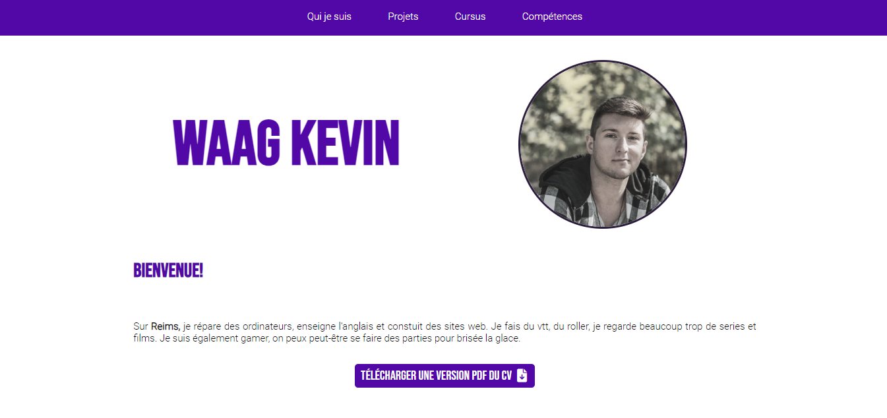

# ResumeRan23

#stillindevelopment 
This is a very simplistic version of my 2023 resume.  
</img>
The menu sticks to the top of the page when you scroll down.
The pictures opens in a modal to appear bigger.

</img>
</img>

Here is a little timeline of my life ;) 
</img>

The skill section is in a grid with borders for now i don't know what to do with them yet. I'm not thrilled of how it looks, especially the positions.
</img>

The contact form is in progress I'll do it when I have the time. Technically the CSS is done i just have to do the php. 

</img>

